# VERA Data Intelligence Platform
### Power BI Engineer — Technical Assessment | RIAR Consulting

<div align="center">


**Candidate:** Harshil Nagwani &nbsp;|&nbsp; **Role:** Power BI Engineer &nbsp;|&nbsp; **Platform:** RIAR Consulting

</div>

---

## Problem Statement

RIAR Consulting requires a multi-domain Business Intelligence platform — **VERA** — to
provide decision-makers with real-time, interactive insights across four critical business
functions: User Engagement, Sales Performance, Operations/Logistics, and Human Resources.

The assessment requires designing, building, and publishing a professional-grade Power BI
report that demonstrates mastery of data modelling, DAX, Power Query, and enterprise
BI best practices including Row-Level Security and drill-through navigation.

---

## Solution Overview

A 10-page interactive Power BI report with:
- **4 main dashboards** (one per business domain)
- **2 drill-through pages** for granular detail
- **2 custom tooltip pages** for hover-based context
- **1 navigation home page** using bookmarks
- **Row-Level Security** across 5 roles
- **Python visual** for heatmap analytics

---

## Repository Structure

```
vera-powerbi-assessment/
│
├── README.md                          ← You are here
├── requirements.txt                   ← Python dependencies
├── .gitignore                         ← Ignores .pbix, large CSVs
│
├── data/
│   ├── raw/
│   │   └── README.md                  ← Dataset sources & download links
│   └── processed/
│       └── README.md                  ← Pre-processing notes
│
├── scripts/
│   ├── fix_operations_timestamps.py   ← Fixes corrupted timestamp columns
│   ├── clean_hr_dataset.py            ← Engineers HR calculated columns
│   
│
├── docs/
│   ├── architecture.md                ← Data model & relationship design
│   ├── dax_measures.md                ← All DAX measures with formulas
│   ├── data_dictionary.md             ← Column-level documentation
│   ├── rls_design.md                  ← Row-Level Security role definitions
│   └── task_notes/
│       ├── task1_user_intelligence.md
│       ├── task2_sales_intelligence.md
│       ├── task3_operations_intelligence.md
│       └── task4_hr_intelligence.md
│
└── screenshots/
    └── README.md                      
```

---

## Tech Stack

| Layer | Tool | Purpose |
|-------|------|--------|
| BI & Visualisation | Microsoft Power BI Desktop | Dashboard design, DAX, RLS |
| Data Modelling | Power Query (M Language) | ETL, column engineering, type fixing |
| Calculations | DAX | Measures, KPIs, time-intelligence |
| Pre-processing | Python 3.x (pandas, numpy) | Fix corrupted timestamps, engineer columns |
| Python Visuals | matplotlib + seaborn | Heatmap visual inside Power BI |
| Publishing | Power BI Service | Live dashboard hosting |
| Version Control | GitHub | Repository & documentation |

---

## Dashboards Built

### Task 1 — User Intelligence
**Dataset:** Course completion & learner engagement platform data  
**KPIs:** Total Enrollments · Completion Rate % · Avg Score · Avg Engagement · Active Users

**Key Findings:**
- Sub-50% completion in several departments — training engagement gap identified
- Enrollment peaks suggest batch onboarding cycles, not continuous learning culture
- IT/IS and Software Engineering lead in avg score; Production has highest volume

---

### Task 2 — Sales Intelligence
**Dataset:** E-commerce retail transactions (Superstore, ~10,000 rows)  
**KPIs:** Total Revenue · Profit Margin % · YTD Revenue · MoM Growth % · Top Products

**Key Findings:**
- Technology = 37% of revenue; Furniture shows negative margins despite high revenue
- West region leads all regions in total revenue
- Discounts >30% consistently result in near-zero or negative profit margins

---

### Task 3 — Operations Intelligence
**Dataset:** 25,000 delivery records across 9 logistics partners (India)  
**KPIs:** On Time Rate % · Delay Rate % · Avg Delay Hours · Partner Rating · Total Cost

**Key Findings:**
- Overall On-Time Rate: **73.32%** — 1 in 4 deliveries is late
- Stormy weather = **41.45%** delay rate vs 17.43% in clear weather (2.6× higher)
- All 5 regions within 1.45pp of each other — geography is NOT the bottleneck

---

### Task 4 — HR Intelligence
**Dataset:** 311-employee HR management system export (HRDataset_v14)  
**KPIs:** Attrition Rate % · Active Employees · Avg Salary · Performance Distribution

**Key Findings:**
- **33.44%** overall attrition — more than 2× the healthy 10–15% benchmark
- Production dept: **39.71%** attrition with lowest avg salary ($59,954)
- Top 3 exit reasons account for **43% of all terminations** — all preventable


**Published Report:**
https://app.powerbi.com/groups/me/reports/f99559a6-49dd-4226-95fd-5be97ff3ab55/dc9efbb841c9cf1cc9ff?experience=power-bi
---

## Setup & Run Instructions

### Prerequisites
- [Microsoft Power BI Desktop](https://powerbi.microsoft.com/desktop/) (free)
- Python 3.8+ with pandas, numpy (for pre-processing scripts only)

### 1. Clone the Repository
```bash
git clone https://github.com/harshilnagwani/vera-powerbi-assessment.git
cd vera-powerbi-assessment
```

### 2. Install Python Dependencies
```bash
pip install -r requirements.txt
```

### 3. Run Pre-processing Scripts (if starting from raw data)
```bash
# Fix Operations dataset (corrupted timestamps)
python scripts/fix_operations_timestamps.py

# Clean HR dataset (engineer calculated columns)
python scripts/clean_hr_dataset.py
```

### 4. Open Power BI Report
- Open Power BI Desktop → File → Open → select `vera-dashboard.pbix`
- If prompted, update the data source path to your local `data/processed/` folder

### 5. Explore the Dashboard
- Start at the **Home** page for bookmark-based navigation
- Use slicers (region, date range, department) to filter any dashboard
- Right-click any data point → **Drill Through** for detail pages
- Hover over bar charts to activate **custom tooltip** pages

---

## Data Pre-processing Notes

### Operations Dataset — Critical Fix
The `delivery_time_hours` and `expected_time_hours` columns were stored as corrupted
Unix timestamp strings (e.g., `1970-01-01 00:00:00.000000008`). The actual integer
hour values were encoded in the **nanosecond digits** at the tail of each string.

```python
# Core fix logic (see scripts/fix_operations_timestamps.py)
extracted = series.astype(str).str.extract(r'(\d+)$')[0]
df['delivery_time_hours'] = pd.to_numeric(extracted).astype(int)
```

### HR Dataset — Engineered Columns
Four columns calculated before loading into Power BI:
- `Status` — "Active" / "Terminated" (simplified from EmploymentStatus)
- `Attrition_Flag` — binary 1/0 from Status
- `PerformanceScore_Num` — numeric mapping (Exceeds=4, Fully Meets=3, etc.)
- `Tenure_Years` — from DateofHire to exit date or 2024-01-01 for active employees

---

## DAX Highlights

```dax
-- Attrition Rate with proper denominator
Attrition Rate % =
DIVIDE(
    CALCULATE(COUNTROWS(HR), HR[Status] = "Terminated"),
    COUNTROWS(HR), 0
) * 100

-- Month-over-Month Revenue Growth
MoM Revenue Growth % =
VAR CurrentMonth = [Total Revenue]
VAR PrevMonth = CALCULATE([Total Revenue], DATEADD(DateTable[Date], -1, MONTH))
RETURN DIVIDE(CurrentMonth - PrevMonth, PrevMonth, 0) * 100

-- Delay Rate for Operations
Delay Rate % =
DIVIDE(
    CALCULATE(COUNTROWS(Operations), Operations[status_label] = "Delayed"),
    COUNTROWS(Operations), 0
) * 100
```

Full measure library → [`docs/dax_measures.md`](docs/dax_measures.md)

---

## Row-Level Security

| Role | Filter | Restricts To |
|------|--------|--------------|
| HR_Production | `[Department] = "Production"` | Production managers |
| HR_IT | `[Department] = "IT/IS"` | IT managers |
| HR_Sales | `[Department] = "Sales"` | Sales managers |
| Ops_West | `[region] = "west"` | West region ops team |
| Ops_Central | `[region] = "central"` | Central region ops team |

All roles tested via **Modeling → View as Roles** in Power BI Desktop.

---

## Key Learnings & Highlights

1. **Timestamp Forensics** — Reverse-engineered corrupted nanosecond Unix timestamps to extract integer hour values; a real-world data quality challenge solved with Python
2. **Centralised Date Table** — One `CALENDAR()` table powers all time-intelligence across all 4 datasets simultaneously
3. **Continuous vs Binary Metrics** — Engineered `delay_hours` (continuous) alongside the binary flag to enable average delay analysis, not just count-based delay tracking
4. **RLS Architecture** — Static roles that mirror an org hierarchy, verified with View as Roles before publishing
5. **Python in Power BI** — Used matplotlib heatmap to visualise a Region × Vehicle-Type delay matrix not achievable with native visuals alone

---
## Screenshots

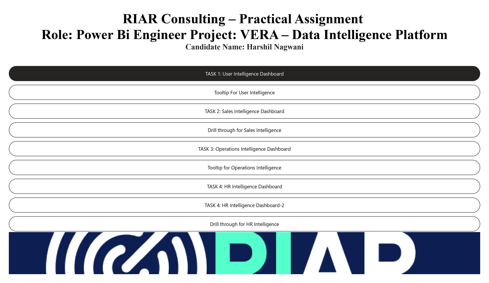
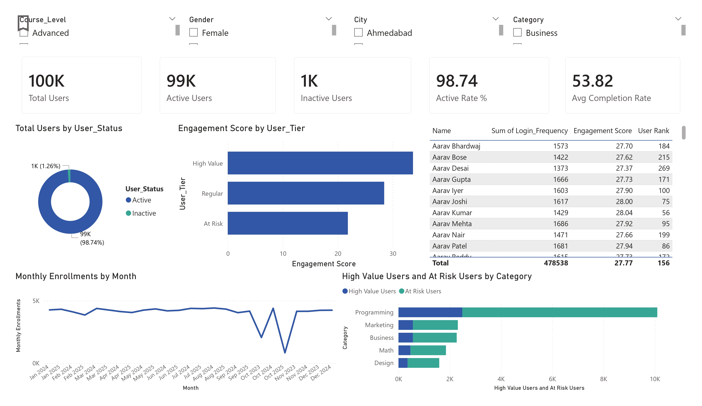
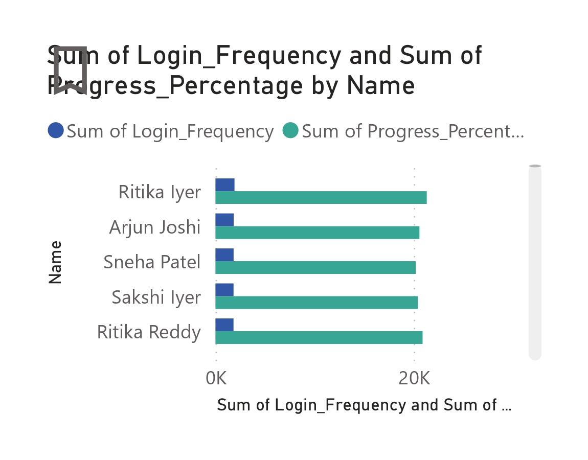
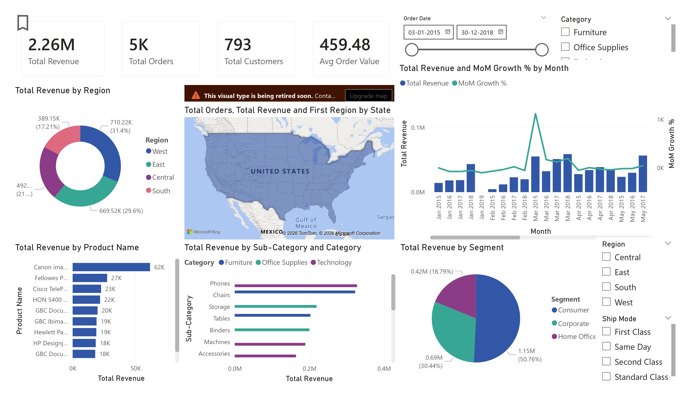
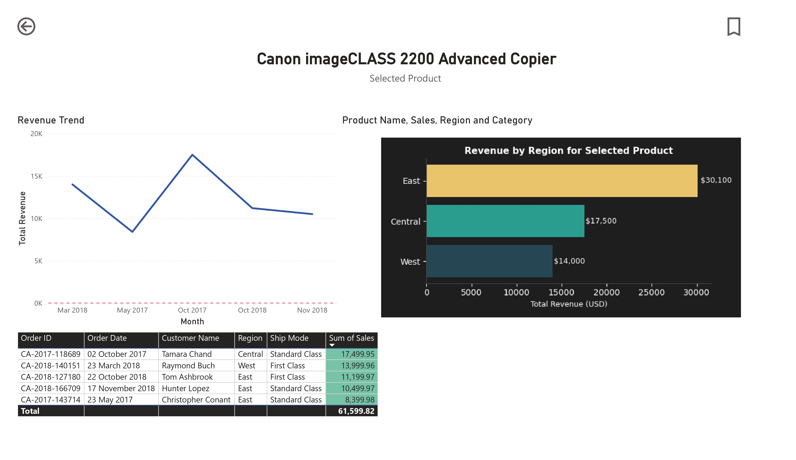
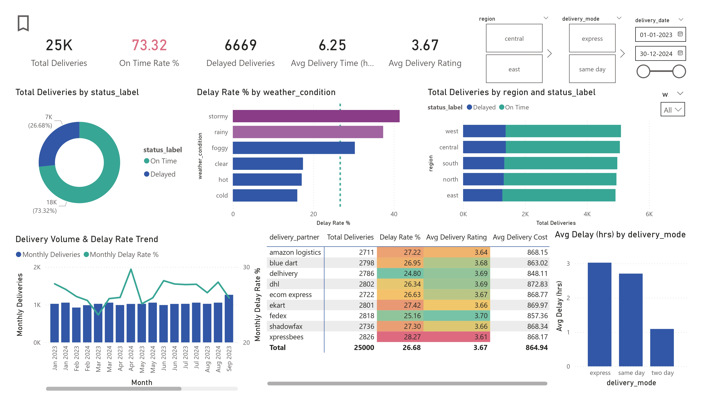
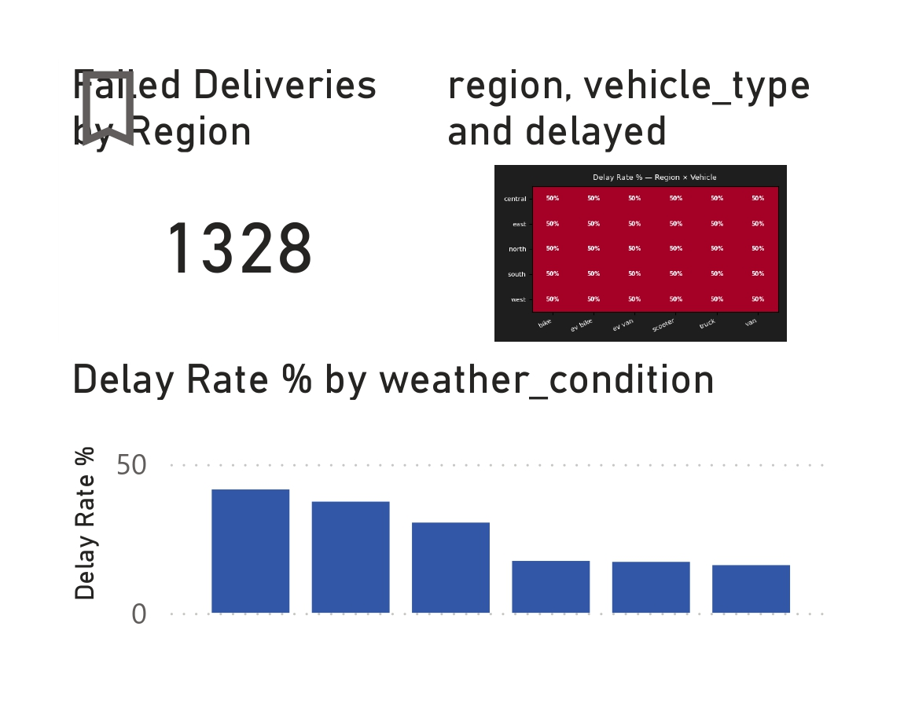
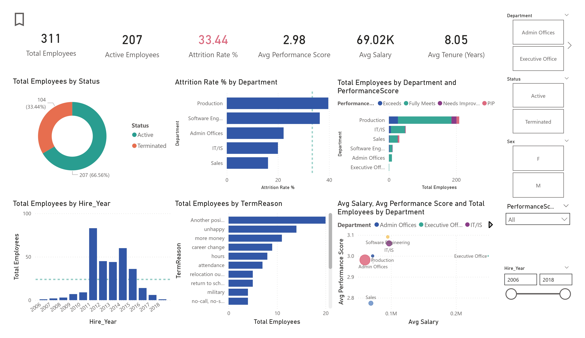
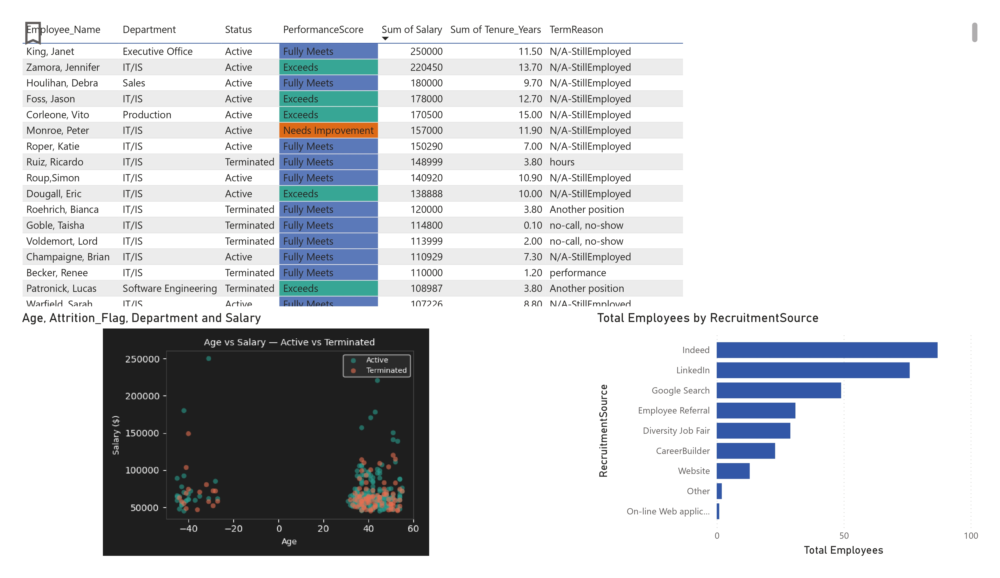
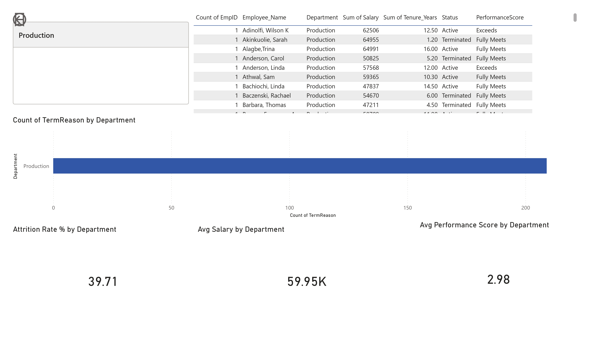
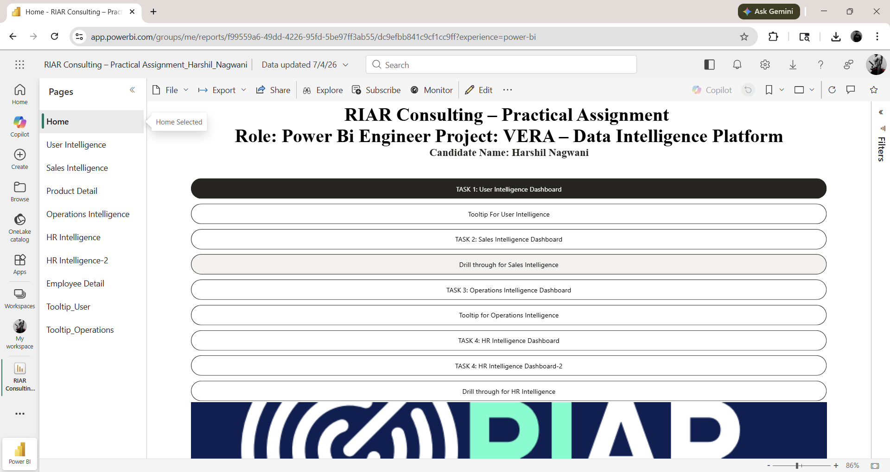


---
## Contact

**Harshil Nagwani**  
- GitHub: [@harshilnagwani](https://github.com/harshilnagwani)  
- LinkedIn: [linkedin.com/in/harshilnagwani](https://linkedin.com/in/harshilnagwani)

---

<div align="center">
<sub>Built for RIAR Consulting — VERA Data Intelligence Platform Assessment · April 2026</sub>
</div>
